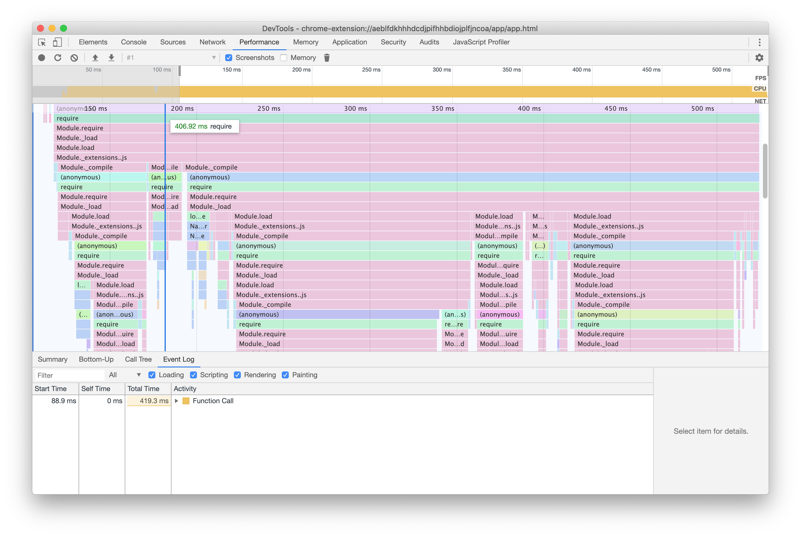
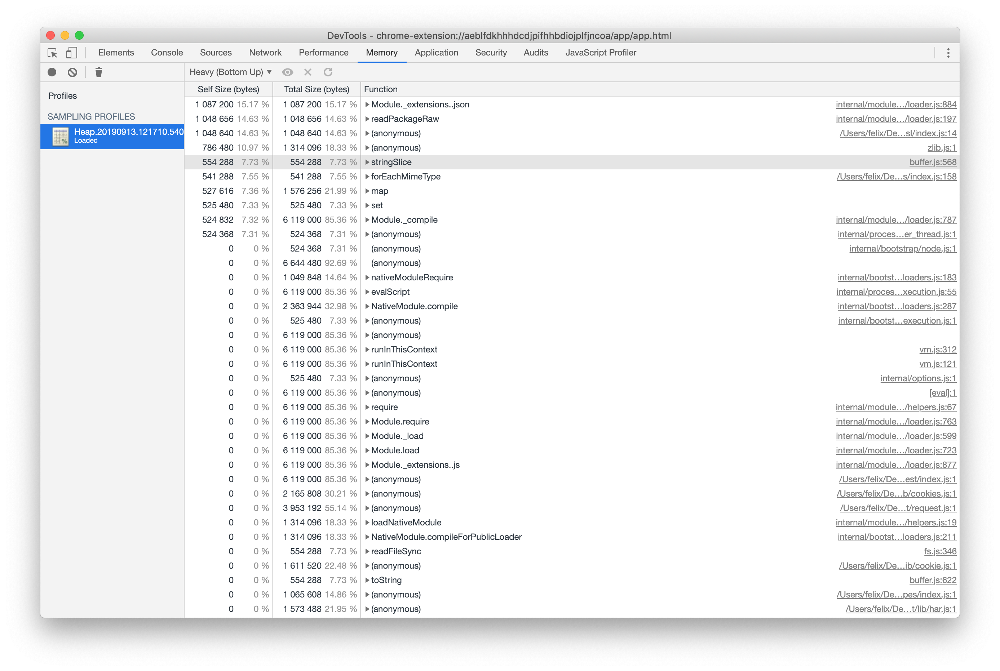

# [性能](https://www.electronjs.org/docs/latest/tutorial/performance#1-carelessly-including-modules)

开发人员经常询问优化 Electron 应用性能的策略。软件工程师、用户和框架开发者对 "性能 "的定义并不总是一致的。本文档概述了一些 Electron 维护者最喜欢的方法，以减少内存、CPU 和磁盘资源的使用量，同时确保应用程序对用户输入做出响应，并尽快完成操作。此外，我们希望所有的性能策略都能为应用程序的安全性保持高标准。

有关如何使用 JavaScript 构建高性能网站的智慧和信息通常也适用于 Electron 应用程序。在某种程度上，讨论如何构建高性能 Node.js 应用程序的资源也同样适用，但要注意理解，"性能 "一词对于 Node.js 后端和客户端上运行的应用程序的意义是不同的。

本列表仅为方便您使用而提供，与我们的[安全清单]（https://www.electronjs.org/docs/latest/tutorial/security）一样，并非详尽无遗。也许你可以按照下面列出的所有步骤来构建一个缓慢的 Electron 应用程序。Electron 是一个强大的开发平台，开发者可以随心所欲。所有这些自由意味着性能在很大程度上是你的责任。

## 测量，测量，测量 Measure, Measure, Measure

下面列出了一些相当直接且易于实施的步骤。但是，要构建性能最佳的应用程序版本，您需要采取更多步骤。相反，您必须通过仔细分析和测量来仔细检查应用程序中运行的所有代码。瓶颈在哪里？当用户点击按钮时，哪些操作占用了大量时间？当应用程序处于闲置状态时，哪些对象占用的内存最多？

我们一次又一次地发现，构建高性能 Electron 应用程序的最成功策略是剖析运行中的代码，找出其中最耗费资源的部分，并对其进行优化。反复重复这一看似费力的过程，将极大地提高应用程序的性能。使用 Visual Studio Code 或 Slack 等大型应用程序的经验表明，这种做法是迄今为止提高性能最可靠的策略。

要进一步了解如何剖析应用程序的代码，请熟悉 Chrome 浏览器开发工具。如需同时对多个进程进行高级分析，请考虑使用 [Chrome 浏览器跟踪](https://www.chromium.org/developers/how-tos/trace-event-profiling-tool/)工具。

### 推荐阅读

-   [分析运行时性能](https://developer.chrome.com/docs/devtools/performance?hl=zh-cn)
-   [演讲："Visual Studio Code - 第一秒"](https://www.youtube.com/watch?v=r0OeHRUCCb4)

## 阻塞性能清单

如果尝试这些步骤，您的应用程序很可能会更精简、更快速，而且对资源的消耗也会更少。

### 1、不小心引入的模块

在将 Node.js 模块添加到您的应用程序之前，请检查该模块。该模块包含多少依赖项？它需要什么样的资源才能在 require() 语句中简单调用？你可能会发现，在 NPM 软件包注册表上下载次数最多或在 GitHub 上获得最多星星的模块，实际上并不是最精简或最小的模块。

#### 为什么呢？

我们可以通过一个真实的例子来说明这一建议背后的原因。在 Electron 的早期，网络连接的可靠检测是一个问题，导致许多应用程序使用一个暴露了简单 isOnline() 方法的模块。

该模块通过尝试连接一些知名端点来检测您的网络连接。至于这些端点的列表，它依赖于一个不同的模块，该模块也包含一个众所周知的端口列表。这个依赖关系本身依赖于一个包含端口信息的模块，该模块以 JSON 文件的形式存在，内容超过 10 万行。每当加载模块时（通常是在 require('module') 语句中），模块就会加载其所有依赖项，并最终读取和解析该 JSON 文件。解析数千行 JSON 是一项非常昂贵的操作。在速度较慢的机器上，可能需要花费整整几秒钟的时间。

在许多服务器环境中，启动时间几乎无关紧要。一个需要所有端口信息的 Node.js 服务器，如果能在服务器启动时将所有需要的信息加载到内存中，那么它的性能实际上可能会 "更强"，这样做的好处是能更快地处理请求。本例中讨论的模块并非 "坏 "模块。但是，Electron 应用程序不应加载、解析并在内存中存储实际上并不需要的信息。

简而言之，一个主要为运行 Linux 的 Node.js 服务器编写的看似优秀的模块，可能会对应用程序的性能造成影响。在这个特殊的例子中，正确的解决方案是不使用任何模块，而是使用 Chromium 后续版本中包含的连接性检查。

#### 如何做到？

在考虑模块时，我们建议您检查：
1、所引入的依赖的大小
2、加载 (require()) 所需的资源
3、执行您感兴趣的操作所需的资源

只需在命令行下达一条命令，就能为加载模块生成 CPU 配置文件和堆内存配置文件。在下面的示例中，我们将查看流行的模块请求

```javascript
node --cpu-prof --heap-prof -e "require('request')"
```

执行该命令后，会在执行该命令的目录下生成一个 .cpuprofile 文件和一个 .heapprofile 文件。这两个文件都可以使用 Chrome 浏览器开发工具的 "性能 "和 "内存 "选项卡进行分析。




在这个例子中，在作者的机器上，我们看到加载请求耗时将近半秒，而节点撷取占用的内存大幅减少，不到 50 毫秒。

### 2、过早加载和运行代码

如果有昂贵的设置操作，请考虑推迟这些操作。检查应用程序启动后立即执行的所有工作。与其立即执行所有操作，不如考虑按照更贴近用户体验的顺序交错执行。

在传统的 Node.js 开发中，我们习惯于将所有 require() 语句放在顶部。如果你正在使用同样的策略编写 Electron 应用程序，并且正在使用不急需的大型模块，那么请使用同样的策略，将加载推迟到更合适的时间。

#### 为什么？

加载模块是一项非常昂贵的操作，尤其是在 Windows 系统上。应用程序启动时，不应让用户等待目前不需要的操作。

这看似显而易见，但许多应用程序往往会在启动后立即执行大量工作，如检查更新、下载稍后流程中使用的内容或执行繁重的磁盘 I/O 操作。

让我们以 Visual Studio Code 为例。当你打开一个文件时，它会立即将文件显示给你，而不显示任何代码高亮，优先考虑你与文本交互的能力。一旦完成这项工作，它就会开始高亮显示代码。

#### 怎么做？

让我们举个例子，假设你的应用程序正在解析虚构的 .foo 格式文件。为此，它依赖于同样虚构的 foo-parser 模块。在传统的 Node.js 开发中，您可能会编写急于加载依赖项的代码：

```javascript
const fs = require("node:fs");
const fooParser = require("foo-parser");

class Parser {
    constructor() {
        this.files = fs.readdirSync(".");
    }

    getParsedFiles() {
        return fooParser.parse(this.files);
    }
}

const parser = new Parser();

module.exports = { parser };
```

在上述示例中，我们正在进行大量工作，这些工作在文件加载后立即执行。我们需要立即获取解析后的文件吗？我们能不能稍晚一些，在实际调用 getParsedFiles() 时再做这项工作？

```javascript
// "fs" is likely already being loaded, so the `require()` call is cheap
const fs = require("node:fs");

class Parser {
    async getFiles() {
        // Touch the disk as soon as `getFiles` is called, not sooner.
        // Also, ensure that we're not blocking other operations by using
        // the asynchronous version.
        this.files = this.files || (await fs.promises.readdir("."));

        return this.files;
    }

    async getParsedFiles() {
        // Our fictitious foo-parser is a big and expensive module to load, so
        // defer that work until we actually need to parse files.
        // Since `require()` comes with a module cache, the `require()` call
        // will only be expensive once - subsequent calls of `getParsedFiles()`
        // will be faster.
        const fooParser = require("foo-parser");
        const files = await this.getFiles();

        return fooParser.parse(files);
    }
}

// This operation is now a lot cheaper than in our previous example
const parser = new Parser();

module.exports = { parser };
```

简而言之，"及时 "分配资源，而不是在应用程序启动时分配所有资源。

### 3、阻塞主进程

Electron 的主进程（有时称为 "浏览器进程"）很特别：它是应用程序所有其他进程的父进程，也是操作系统与之交互的主要进程。它负责处理窗口、交互以及应用程序内各组件之间的通信。它也是用户界面线程的所在。

在任何情况下，都不应阻塞该进程和 UI 线程的长期运行操作。阻塞用户界面线程意味着整个应用程序将冻结，直到主进程准备好继续处理。

#### 为什么？

主进程及其 UI 线程基本上是应用程序内部主要操作的控制塔。当操作系统告诉您的应用程序有鼠标点击时，它会先经过主进程，然后再到达您的窗口。如果您的窗口正在渲染一个流畅的动画，那么它需要与 GPU 进程进行对话--再次通过主进程。

Electron 和 Chromium 会小心地将繁重的磁盘 I/O 和 CPU 绑定操作放到新线程上，以避免阻塞用户界面线程。你也应该这样做。

#### 如何做？

Electron 强大的多进程架构可随时协助你完成长期任务，但也有少量性能陷阱。

1、对于长期运行的 CPU 负荷较大的任务，可使用工作线程，考虑将其移至 BrowserWindow，或（作为最后手段）生成一个专用进程。
2、尽可能避免使用同步 IPC 和 @electron/remote 模块。虽然有合理的使用情况，但在不知情的情况下阻塞用户界面线程实在太容易了。
3、避免在主进程中使用阻塞 I/O 操作。简而言之，只要 Node.js 核心模块（如 fs 或 child_process）提供同步或异步版本，您就应该优先选择异步和非阻塞变体。

### 4、阻塞渲染进程

由于 Electron 搭载的是当前版本的 Chrome 浏览器，因此你可以利用网络平台提供的最新、最强大的功能来推迟或卸载繁重的操作，从而保持应用程序的流畅性和响应速度。

#### 为什么？

您的应用程序可能需要在渲染器进程中运行大量 JavaScript。诀窍在于尽可能快速地执行操作，同时不占用保持滚动流畅、响应用户输入或 60fps 动画所需的资源。

如果用户抱怨您的应用程序有时会 "卡顿"，那么在渲染器代码中协调操作流就特别有用。

...待续
